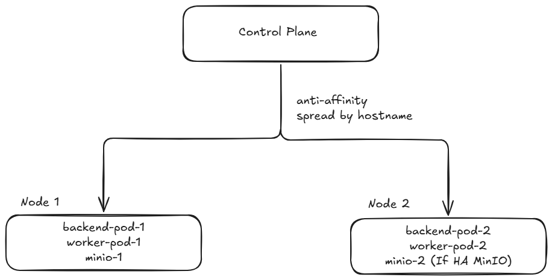
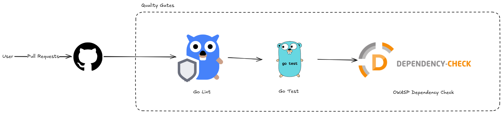
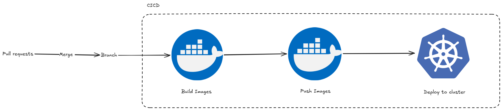

# Agnos DevOps Assignment

## Failure Scenario Handling
### 1) API crashes during peak hours
- Protection:
  - Multiple backend replicas.
  - Readiness + liveness probes.
  - HPA for backend CPU scaling.
  - Pod anti-affinity and PDB.
- Detection:
  - Prometheus alerts (`BackendDown`, `BackendCrashLooping`, `BackendFrequentRestarts`, `HighBackendErrorRate`, `BackendIncidentSimulation`).
- Action:
  1. Check pod status/events in affected namespace.
  2. Inspect backend logs in Loki/Grafana Explore.
  3. Roll back deployment image tag if a bad release caused the crash.

### 2) Worker fails and keeps restarting
- Protection:
  - Worker liveness/readiness via TCP probe on metrics port.
  - Deployment restart behavior by Kubernetes.
- Detection:
  - Alerts: `WorkerDownFromKubeMetrics`, `WorkerStalled`, `WorkerRunFailures`.
  - Restart counters via kube-state-metrics.
- Action:
  1. Check worker logs for MinIO/connectivity/auth errors.
  2. Validate `agnos-app-secrets` and MinIO availability.
  3. Re-deploy fixed worker image if regression introduced.

### 3) Bad deployment is released
- Protection:
  - PR quality gates before merge.
  - Environment-separated overlays and tags.
- Detection:
  - Spike in `5xx`, crash loop alerts, and service unavailability.
- Action:
  1. Roll back by setting a known good image tag in overlay and re-apply.
  2. Re-run smoke checks (`/health`, `/records`, `/mock/500`).

### 4) Kubernetes node goes down
- Protection:
  - Backend anti-affinity helps spread across nodes.
  - Replica-based recovery and rescheduling.
- Detection:
  - Pod restarts/unavailable replicas in Prometheus and Grafana.
- Action:
  1. Confirm node state and pod rescheduling.
  2. Verify service endpoints and alert recovery.
  3. Scale up or replace failed node capacity.

## Architecture Overview
This repository contains:
- `backend`: API workload.
- `worker`: background workload.
- `k8s`: Kubernetes app manifests with `base` + `overlays` (`dev`, `uat`, `prod`).
- `monitoring`: one-time shared monitoring stack (Prometheus + Loki + Alloy + Grafana + kube-state-metrics).

Architecture diagram:


Runtime flow (high level):
- Client traffic enters backend service; worker handles async/background processing; observability data is centralized through Prometheus/Loki/Grafana.

### Architecture Decisions (Why This Design)
1. Kustomize overlays (`k8s/overlays/dev|uat|prod`)
- Chosen to keep one reusable base manifest and apply only environment-specific differences (replicas, HPA tuning, storage size, secrets refs).
- Reduces config drift and makes promotion from `dev -> uat -> prod` predictable.

2. Namespace separation (`agnos-dev`, `agnos-uat`, `agnos-prod`)
- Isolates workloads and configuration per environment.
- Limits blast radius so issues in one environment do not directly affect another.

3. High availability for API path
- Backend runs with multiple replicas and pod anti-affinity to spread across nodes.
- PodDisruptionBudget (PDB) protects minimum availability during voluntary disruptions.
- HPA scales backend replicas by load to keep service stable during traffic spikes.

4. Reliability controls on all workloads
- Readiness probes prevent traffic to unready pods.
- Liveness probes auto-restart unhealthy containers.
- Resource requests/limits improve scheduler decisions and reduce noisy-neighbor risk.

5. Separate backend and worker deployments
- API and background processing are independently scalable and recoverable.
- Worker failures/restarts do not directly impact API availability.

6. Observability-first operations
- Prometheus provides service and platform metrics.
- Alloy + Loki provide centralized logs.
- Grafana correlates metrics and logs for faster incident triage.

## API Endpoints
- `GET /health` (backend)
- `GET /metrics` (backend)
- `GET /records` (backend)
- `POST /records` (backend)
- `GET /mock/500` (backend, test endpoint for synthetic 500)

`POST /records` payload example:
```json
{
  "name": "example record"
}
```

## Prerequisites
- Docker
- Kubernetes cluster (Kind/Minikube/managed)
- `kubectl`
- `go` (for local tests)

## Setup Instructions
1. Create/point to your Kubernetes cluster.
2. Deploy monitoring stack once:
```powershell
kubectl apply -f monitoring/namespace.yaml
kubectl apply -f monitoring/
```
3. Deploy app stack for one environment:
```powershell
kubectl apply -k k8s/overlays/dev
# or
kubectl apply -k k8s/overlays/uat
# or
kubectl apply -k k8s/overlays/prod
```

## Usage Instructions
Port-forward services for local access:
```powershell
kubectl -n agnos-dev port-forward svc/backend 8080:80
kubectl -n agnos-dev port-forward svc/minio 9000:9000 9001:9001
kubectl -n monitoring port-forward svc/grafana 3000:3000
kubectl -n monitoring port-forward svc/prometheus 9090:9090
```

Quick checks:
```powershell
curl http://localhost:8080/health
curl http://localhost:8080/records
curl -X POST http://localhost:8080/records -H "Content-Type: application/json" -d "{\"name\":\"demo\"}"
curl http://localhost:8080/mock/500
```

Grafana:
- URL: `http://localhost:3000`
- Default credentials: `admin` / `admin` (from `monitoring/grafana-admin-secret.yaml`)

MinIO console:
- URL: `http://localhost:9001`
- Credentials from overlay secret `agnos-minio-secrets` (`MINIO_ROOT_USER`, `MINIO_ROOT_PASSWORD`)
- Security note: values defined in overlay `secretGenerator` are for demo/local use only. Do not store real credentials in overlays for real-world environments; use a proper secret manager or sealed/external secrets flow.

## CI/CD Pipeline
Workflow files:
- `.github/workflows/quality-gates.yaml`
- `.github/workflows/cicd.yaml`

Repository policy note:
- Enable Branch Protection Rules in GitHub.
- Require pull requests for merges into deployment branches (`uat`, `main`).
- Developers should merge from `develop` to deployment branches only via PR (no direct push), so quality gates and review are enforced before deployment.

Pipeline overview:
1. `quality-gates.yaml` protects pull requests before merge.
2. `cicd.yaml` runs on branch push for build/release/deploy flow.

Pipeline diagrams:



### 1) Quality Gates Pipeline (`quality-gates.yaml`)
Trigger:
- Runs on `pull_request` targeting `develop`, `uat`, or `main`.

Execution model:
- Uses a matrix for `backend` and `worker`, so both services are validated independently in the same PR.

Step-by-step:
1. Checkout only the target app directory (sparse checkout).
2. Setup toolchains:
- Go (`actions/setup-go`)
- Node.js (`actions/setup-node`)
- Java (`actions/setup-java`) for OWASP dependency-check runtime
3. Run Go lint via `golangci-lint`.
4. Run unit tests via `go test`.
5. Run OWASP Dependency-Check with fail threshold `CVSS >= 7`.
6. Upload dependency-check HTML report as workflow artifact (always uploads, including failures).

Outcome:
- PRs are blocked when lint, test, or dependency security gates fail.

### 2) CI/CD Pipeline (`cicd.yaml`)
Trigger:
- Runs on `push` to `develop`, `uat`, and `main`.

Branch to environment mapping:
- `develop` -> `dev` namespace `agnos-dev`
- `uat` -> `uat` namespace `agnos-uat`
- `main` -> `prod` namespace `agnos-prod`

#### CI job (`ci`)
Execution model:
- Matrix on `backend` and `worker`.

Step-by-step:
1. Checkout only service directory (sparse checkout).
2. Use shared resolver job outputs (`env_tag`, `backend_version_tag`, `worker_version_tag`) for image tagging.
3. Docker Hub login step is mocked (no real registry login in current workflow).
4. QEMU + Buildx setup steps are mocked.
5. Image build/tag/push stage is mocked and logs mock `docker build`, `docker tag`, and `docker push` commands for env tag and commit SHA tag. On `main` (`prod`), CI consumes version tags calculated by the shared resolver from mocked base versions + Conventional Commits: https://www.conventionalcommits.org/en/v1.0.0/
6. Mock version bump rules for prod:
- `major`: commit contains `BREAKING CHANGE:` or header uses `!` (example: `feat(api)!: ...`)
- `minor`: commit header starts with `feat:`
- `patch`: all other commits (including `fix:`, `chore:`, `docs:`, etc.)

Expected tags (when real push is enabled):
- `rywj/backend:<env-tag>`
- `rywj/backend:<commit-sha>`
- `rywj/worker:<env-tag>`
- `rywj/worker:<commit-sha>`

#### CD job (`cd`)
Dependency:
- Runs only after successful `resolve-version` and `ci` jobs.

Step-by-step:
1. Checkout only `k8s` manifests (sparse checkout).
2. Resolve target environment + namespace from branch.
3. Use shared resolver outputs to mock-update backend/worker image tags in prod overlay.
4. Create/update `agnos-app-secrets` in target namespace using env-specific GitHub secrets.
5. Deployment stage is currently mocked and logs mock `kubectl apply -k ./k8s/overlays/<env>` command.
6. Verify rollout with:
- `kubectl rollout status deployment/backend`
- `kubectl rollout status deployment/worker`
- `kubectl rollout status deployment/minio`

Current behavior note:
- Build and all Kubernetes-related deployment steps are mocked in CI/CD workflow.

Required GitHub secrets for app credentials:
- `DEV_MINIO_ACCESS_KEY`, `DEV_MINIO_SECRET_KEY`
- `UAT_MINIO_ACCESS_KEY`, `UAT_MINIO_SECRET_KEY`
- `PROD_MINIO_ACCESS_KEY`, `PROD_MINIO_SECRET_KEY`

## Validation Commands
```powershell
go test ./... # run in backend/
go test ./... # run in worker/
kubectl kustomize k8s/overlays/dev
kubectl kustomize k8s/overlays/uat
kubectl kustomize k8s/overlays/prod
kubectl apply --dry-run=client -f monitoring/
```

## Alert Simulation Demo
This demo uses a dedicated alert rule: `BackendIncidentSimulation`.

1. Ensure the latest monitoring rule is applied:
```powershell
kubectl apply -f monitoring/prometheus-configmap.yaml
kubectl -n monitoring rollout restart deployment/prometheus
```

2. Trigger the synthetic incident:
```powershell
curl http://localhost:8080/mock/500
```

3. Verify alert in Prometheus:
```powershell
# open http://localhost:9090/alerts
# or query:
# ALERTS{alertname="BackendIncidentSimulation"}
```
